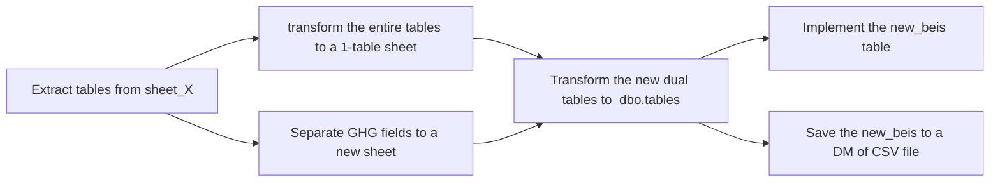

> # The workflow in detail:
> ***
> 1- Extract <SHEET_NAME> tables into a <ghg_SHEET_NAME>.xlsx stacked as one table with the header at the top.
1.2- This XLSX will contain other 2 sheets. The first sheet could be any name.
> ***
> 2- Use python code via pandas_framework within two main functions, generating the new sheets as follows:
2.I- Obtain the GHG unit/factor fields in a separate list from other fields. With determining the number of records to propagate the default values for the nonexisting fields(e.g. Year, Combustion_or_WTT) in the given XLSX.
2.II- The first function, defines a dictionary of the other fields from the main table to be added, in which some field uses the `categorization()` to assign values to be filled all over the records as described from the main XLSX (as some levels are assigned as headers, so this will unpivot these values into rows afterwards).
2.II.2- As been said, `ffill()` is used to fill the empty cells of merged ones by the top-left value belonging to this range of cells, afterwhich we added the remaining fields.
2.III- before we right the modification made by the first function, we call the second function to create a new sheet to the new XLSX in which we are adding the GHG units/factors within the ID of each record.
2.II.3- After, we drop the GHG factors/units from the main extracted table, then write the rest to another sheet.
> ***
> 3- We transfer each sheet from the new XLSX to a dbo.table through an R_DBMS.
3.2- We apply `EQUI-JOIN` between both tables upon the **id** attribute, adding the result to an intermediate view.
3.3- then create the dedicated schema using `CREATE <table>INTO(SELECT * FROM <view>)`.
> ***
> 4- Load the full resulting table to a csv within headers, then submitting the file to the reporter,*Mohammad Saad*.
